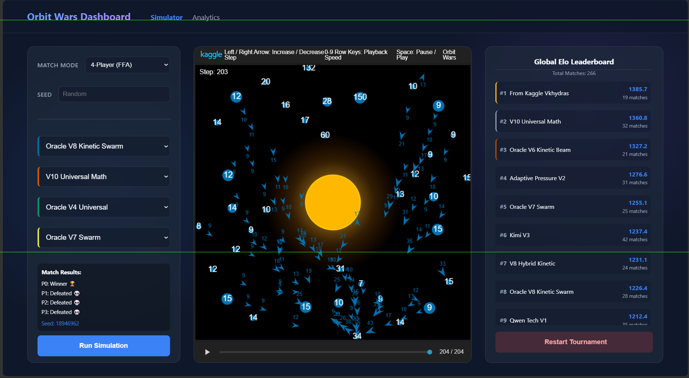

# Orbit Wars - AI Agent Tournament Framework



Orbit Wars is a fast-paced, real-time strategy space game where players conquer planets by dispatching fleets of ships. This repository provides a **Complete Local Framework** to build, test, and run an automated ELO tournament for your AI agents before submitting them to the Kaggle competition.

## 🚀 Features

- **Local ELO Tournament Engine (`tournament.py`)**: Runs continuous 2v2 and 4-player Free-For-All matches in the background. It automatically detects agents, runs matchmaking, and calculates Pairwise ELO (so 1st place beats everyone, 2nd beats 3rd and 4th, etc.).
- **Live HTML Dashboard (`app.py`)**: A local Flask web server that provides a gorgeous UI to:
  - View the live Global ELO Leaderboard.
  - Manually select agents and click "Run Simulation" to watch a match visually.
  - View HTML replays of past matches.
- **Starter Agents Included**: The `agents/` folder contains various baseline bots ranging from simple nearest-target logic (`v1_baseline.py`) to more advanced swarming strategies (`v5_swarm_intelligence.py`). You can use these as punching bags to train your own advanced models!

## 📁 Repository Structure

```
Orbit Wars/
├── agents/                  # Place your active AI bots here (.py)
├── app.py                   # Flask server for the Dashboard UI
├── tournament.py            # Background ELO Tournament Engine
├── run_match.py             # Script to run a single match and save an HTML replay
├── templates/               # UI HTML files
├── static/                  # UI CSS/JS assets
└── README.md
```

## 🛠️ How to Use

### 1. Installation
Make sure you have Python 3.10+ installed. Install the required Kaggle environments package:
```bash
pip install "kaggle-environments>=1.28.0"
pip install flask
```

### 2. Run the Background ELO Tournament
To start pitting your agents against each other and calculating their ELO:
```bash
python tournament.py
```
*Note: You can leave this running indefinitely. It will automatically save the state to `tournament_state.json` and log match outcomes to `results/match_log.txt`.*

### 3. Open the Dashboard (Web UI)
To view the live leaderboard or watch matches visually, open a separate terminal and run:
```bash
python app.py
```
Then open your browser to: [http://127.0.0.1:5000/](http://127.0.0.1:5000/)

## 🏆 Building Your Own Agent
Just drop your custom `.py` agent file into the `agents/` directory. `tournament.py` and the Web UI will automatically detect it and include it in the next matches. Write your own advanced models and try to conquer the leaderboard!
